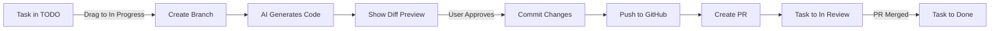

# GitHub Integration Guide
## Kanbanix GitHub-First Development Workflow

## Overview
Every Kanbanix project is backed by a GitHub repository. This guide explains how GitHub integration works with the temporary workspace model.

## Architecture

```
┌──────────────┐     ┌──────────────┐     ┌──────────────┐
│   Dashboard  │────▶│   Project    │────▶│     Task     │
│              │     │              │     │              │
│  List repos  │     │ Clone repo   │     │ Create branch│
└──────────────┘     └──────────────┘     └──────────────┘
       │                    │                     │
       ▼                    ▼                     ▼
  GitHub API          Temp Workspace         Feature Branch
```

## Setup

### 1. GitHub OAuth Configuration

```env
# .env.local
GITHUB_ID=your_github_oauth_app_id
GITHUB_SECRET=your_github_oauth_app_secret
NEXTAUTH_URL=http://localhost:3000
NEXTAUTH_SECRET=your_nextauth_secret
```

### 2. Required GitHub Permissions

```javascript
// OAuth App Scopes
- repo (Full control of private repositories)
- workflow (Update GitHub Action workflows)
- write:packages (Optional: For package publishing)
```

## Project Lifecycle

### Creating a Project

```typescript
// Option 1: Create new GitHub repository
async function createNewProject(name: string, description: string) {
  // Create GitHub repo
  const repo = await octokit.repos.createForAuthenticatedUser({
    name: slugify(name),
    description,
    private: false,
    auto_init: true,
    gitignore_template: 'Node'
  });
  
  // Create project in database
  const project = await prisma.project.create({
    data: {
      name,
      description,
      githubOwner: repo.owner.login,
      githubRepo: repo.name,
      githubUrl: repo.html_url,
      userId: session.user.id
    }
  });
  
  return project;
}

// Option 2: Connect existing repository
async function connectExistingRepo(repoUrl: string) {
  const [owner, repo] = parseGitHubUrl(repoUrl);
  
  // Verify access
  const repoData = await octokit.repos.get({ owner, repo });
  
  // Create project
  const project = await prisma.project.create({
    data: {
      name: repoData.data.name,
      description: repoData.data.description,
      githubOwner: owner,
      githubRepo: repo,
      githubUrl: repoUrl,
      userId: session.user.id
    }
  });
  
  return project;
}
```

### Entering a Project

```typescript
async function enterProject(projectId: string) {
  const project = await getProject(projectId);
  
  // Prepare temporary workspace
  const workspace = `/tmp/workspace/${projectId}`;
  
  // Clone repository
  await git.clone({
    url: `https://github.com/${project.githubOwner}/${project.githubRepo}.git`,
    dir: workspace,
    auth: {
      username: 'x-access-token',
      password: session.accessToken
    }
  });
  
  // Store workspace path in session
  session.workspace = workspace;
  
  return workspace;
}
```

## Task Workflow

### 1. Task Creation
```typescript
interface Task {
  id: string;
  title: string;
  description: string;
  projectId: string;
  status: 'todo' | 'inProgress' | 'inReview' | 'done';
  branch?: string;  // GitHub branch name
  prUrl?: string;   // Pull request URL
}
```

### 2. Branch Strategy

```typescript
// Branch naming convention
const branchName = `ai/task-${taskId}-${slugify(taskTitle)}`;

// Examples:
// ai/task-001-add-header-component
// ai/task-002-fix-login-bug
// ai/task-003-update-styles
```

### 3. Task Execution Flow



### 4. Code Generation Process

```typescript
async function executeTask(task: Task, workspace: string) {
  // 1. Create feature branch from main
  await git.checkout({
    fs,
    dir: workspace,
    ref: `ai/task-${task.id}`,
    create: true
  });
  
  // 2. Read current code
  const files = await readProjectFiles(workspace);
  
  // 3. Send to AI/MCP for processing
  const changes = await mcp.generateCode({
    task: task.title,
    description: task.description,
    currentFiles: files,
    framework: detectFramework(files)
  });
  
  // 4. Apply changes to workspace
  for (const change of changes) {
    if (change.operation === 'create') {
      await fs.writeFile(
        path.join(workspace, change.path),
        change.content
      );
    } else if (change.operation === 'modify') {
      await fs.writeFile(
        path.join(workspace, change.path),
        change.content
      );
    }
  }
  
  // 5. Return diff for preview
  const diff = await git.statusMatrix({ fs, dir: workspace });
  return { changes, diff };
}
```

### 5. Committing and PR Creation

```typescript
async function commitAndCreatePR(task: Task, commitMessage: string) {
  const workspace = session.workspace;
  
  // 1. Stage all changes
  await git.add({ 
    fs, 
    dir: workspace, 
    filepath: '.' 
  });
  
  // 2. Commit
  await git.commit({
    fs,
    dir: workspace,
    message: commitMessage || `AI: ${task.title}`,
    author: {
      name: 'Kanbanix AI',
      email: 'ai@kanbanix.app'
    }
  });
  
  // 3. Push to GitHub
  await git.push({
    fs,
    http,
    dir: workspace,
    remote: 'origin',
    ref: `ai/task-${task.id}`,
    auth: {
      username: 'x-access-token',
      password: session.accessToken
    }
  });
  
  // 4. Create Pull Request
  const pr = await octokit.pulls.create({
    owner: project.githubOwner,
    repo: project.githubRepo,
    title: `AI: ${task.title}`,
    body: generatePRBody(task, changes),
    head: `ai/task-${task.id}`,
    base: 'main'
  });
  
  // 5. Update task with PR URL
  await updateTask(task.id, {
    status: 'inReview',
    prUrl: pr.data.html_url
  });
  
  return pr.data;
}
```

## Diff Preview Component

```tsx
function DiffPreview({ changes }: { changes: FileChange[] }) {
  return (
    <div className="diff-preview">
      <div className="diff-header">
        <h3>Changes to be committed</h3>
        <div className="diff-stats">
          <span className="additions">+{totalAdditions}</span>
          <span className="deletions">-{totalDeletions}</span>
        </div>
      </div>
      
      {changes.map(change => (
        <div key={change.path} className="file-diff">
          <div className="file-header">
            <span className="file-path">{change.path}</span>
            <span className={`file-status ${change.status}`}>
              {change.status}
            </span>
          </div>
          
          <pre className="diff-content">
            <code>{change.diff}</code>
          </pre>
        </div>
      ))}
      
      <div className="diff-actions">
        <button onClick={commitAndPush}>
          Commit & Create PR
        </button>
        <button onClick={discardChanges}>
          Discard Changes
        </button>
      </div>
    </div>
  );
}
```

## GitHub Webhook Integration

### Webhook Events
```javascript
// Configure webhooks for:
- pull_request (opened, closed, merged)
- push (to main branch)
- issues (opened, closed)
```

### Webhook Handler
```typescript
// /api/webhooks/github
export async function POST(request: Request) {
  const signature = request.headers.get('x-hub-signature-256');
  const body = await request.text();
  
  // Verify webhook signature
  if (!verifyWebhookSignature(body, signature)) {
    return new Response('Unauthorized', { status: 401 });
  }
  
  const event = JSON.parse(body);
  
  switch (request.headers.get('x-github-event')) {
    case 'pull_request':
      if (event.action === 'closed' && event.pull_request.merged) {
        // PR merged - update task to done
        await handlePRMerged(event.pull_request);
      }
      break;
      
    case 'push':
      if (event.ref === 'refs/heads/main') {
        // Main branch updated - notify users
        await notifyMainBranchUpdate(event);
      }
      break;
  }
  
  return new Response('OK', { status: 200 });
}
```

## Error Handling

### Authentication Errors
```typescript
try {
  await git.clone({ ... });
} catch (error) {
  if (error.code === 'HTTPError' && error.statusCode === 401) {
    // Token expired - refresh
    const newToken = await refreshGitHubToken();
    // Retry with new token
  }
}
```

### Rate Limiting
```typescript
// Check rate limit before operations
const { data: rateLimit } = await octokit.rateLimit.get();
if (rateLimit.resources.core.remaining < 10) {
  // Wait or notify user
  const resetTime = new Date(rateLimit.resources.core.reset * 1000);
  throw new Error(`GitHub rate limit exceeded. Resets at ${resetTime}`);
}
```

## Security Best Practices

1. **Token Storage**: Never store GitHub tokens in local storage
2. **Webhook Verification**: Always verify webhook signatures
3. **Permission Scoping**: Request minimum required permissions
4. **Branch Protection**: Protect main branch, require PR reviews
5. **Cleanup**: Always clean temporary workspaces

## Deployment Configuration

### Railway/Vercel
```env
# Production environment variables
GITHUB_APP_ID=your_app_id
GITHUB_APP_PRIVATE_KEY=base64_encoded_private_key
GITHUB_WEBHOOK_SECRET=your_webhook_secret
WORKSPACE_PATH=/tmp/workspace
MAX_WORKSPACE_SIZE=500MB
WORKSPACE_TIMEOUT=30m
```

### Self-Hosted
```env
# Self-hosted configuration
WORKSPACE_PATH=/var/lib/kanbanix/workspace
PERSISTENT_WORKSPACE=false
GIT_CLONE_DEPTH=1  # Shallow clone for performance
```

## Monitoring

### Metrics to Track
```typescript
// Track GitHub API usage
- API calls per hour
- Rate limit remaining
- Clone/push duration
- PR creation success rate

// Track workspace usage
- Active workspaces count
- Workspace size
- Cleanup frequency
- Session duration
```

## Troubleshooting

### Common Issues

1. **"Repository not found"**
   - Check GitHub token permissions
   - Verify repository exists and user has access

2. **"No space left on device"**
   - Workspace cleanup failed
   - Increase cleanup frequency
   - Check orphaned workspaces

3. **"Authentication failed"**
   - GitHub token expired
   - Refresh OAuth token
   - Re-authenticate user

4. **"Branch already exists"**
   - Previous task not cleaned up
   - Delete old branch
   - Use unique branch names

## Best Practices

1. **Always work on branches**: Never commit directly to main
2. **Atomic commits**: One task = one commit = one PR
3. **Clean commit messages**: Use conventional commits
4. **Regular syncing**: Pull main branch regularly
5. **Cleanup on exit**: Always delete temporary workspaces