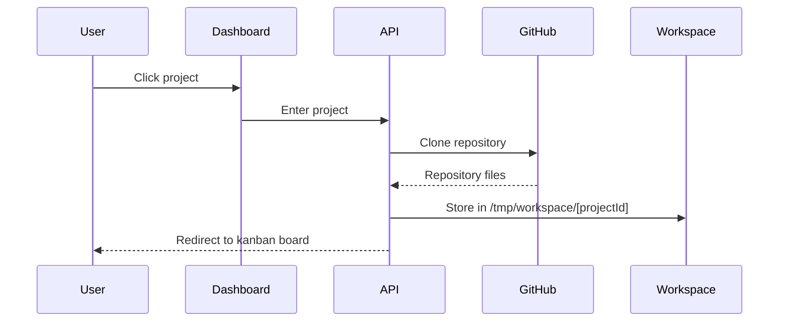
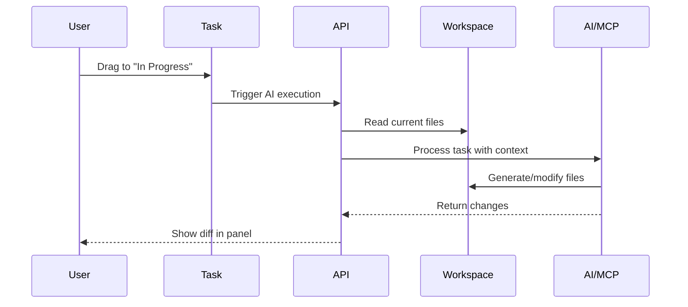
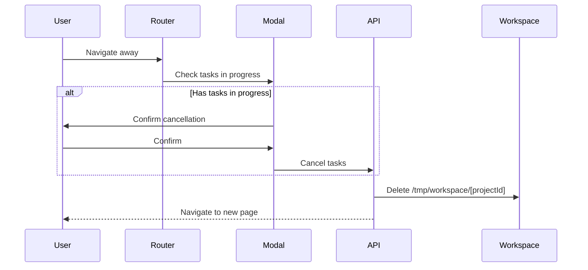

# Kanbanix AI Workflow Specification V2
## Temporary Workspace Architecture

## Overview
Kanbanix uses a **temporary workspace model** where GitHub repositories are cloned on-demand when a user enters a project and automatically cleaned up when they leave. This approach balances performance, functionality, and deployment constraints.

## Core Principles

1. **One Project at a Time**: Each user can only work on one project at a time
2. **Temporary Workspaces**: Repositories are cloned temporarily and deleted on navigation
3. **GitHub as Source of Truth**: All permanent storage is in GitHub
4. **Branch per Task**: Each task creates its own feature branch

## Architecture

### Storage Layers

```
┌─────────────────────────────────────────┐
│         GitHub (Permanent Storage)       │
│  - Main branch (production code)         │
│  - Feature branches (task work)          │
│  - Pull requests (review process)        │
└─────────────────────────────────────────┘
                    ↕
┌─────────────────────────────────────────┐
│      Temporary Local Workspace           │
│  - /tmp/workspace/[projectId]/           │
│  - Exists only during project session    │
│  - Deleted on navigation away            │
└─────────────────────────────────────────┘
                    ↕
┌─────────────────────────────────────────┐
│         Database (Metadata Only)         │
│  - Project references                    │
│  - Task statuses                         │
│  - Execution logs                        │
└─────────────────────────────────────────┘
```

## Workflow

### 1. Project Entry (Dashboard → Project)



**Implementation:**
```typescript
// When user clicks a project from dashboard
async function enterProject(projectId: string) {
  // Show loading state
  setLoading(true, "Preparing workspace...");
  
  // Clone latest main branch to temporary workspace
  const workspace = `/tmp/workspace/${projectId}`;
  await git.clone(project.githubUrl, workspace);
  
  // Navigate to project board
  router.push(`/project/${projectId}`);
}
```

### 2. Task Execution (Drag to In Progress)



**Task Lifecycle:**
```
TODO → In Progress → AI Processing → Review Changes → Commit & Push → PR Created → Done
```

**Implementation:**
```typescript
async function executeTask(task: Task) {
  // Create feature branch
  const branchName = `ai/task-${task.id}-${slugify(task.title)}`;
  await git.checkout(branchName, { create: true });
  
  // AI reads current code from workspace
  const currentCode = await readWorkspaceFiles(workspace);
  
  // AI generates changes
  const changes = await mcp.execute({
    task: task.title,
    context: currentCode,
    workspace: workspace
  });
  
  // Apply changes locally (not committed yet)
  await applyChangesToWorkspace(changes);
  
  // Show diff to user
  return {
    branch: branchName,
    changes: changes,
    status: 'pending_review'
  };
}
```

### 3. Project Exit (Navigation Away)



**Implementation:**
```typescript
// Route guard on navigation
async function beforeLeaveProject() {
  const tasksInProgress = tasks.filter(t => t.status === 'inProgress');
  
  if (tasksInProgress.length > 0) {
    const confirmed = await showModal({
      title: 'Tasks in Progress',
      message: `${tasksInProgress.length} tasks are in progress and will be cancelled.`,
      buttons: ['Stay', 'Leave Anyway']
    });
    
    if (!confirmed) return false; // Cancel navigation
    
    // Reset tasks to TODO
    await resetTasksToTodo(tasksInProgress);
  }
  
  // Clean up workspace
  await deleteWorkspace(projectId);
  return true; // Allow navigation
}
```

## Task Types and AI Behavior

### Sequential Tasks Example

```
Project: "My React App"
Tasks:
1. Create React boilerplate → Creates initial structure
2. Add counter component → Reads task 1's code, adds counter
3. Add reset button → Reads task 1+2's code, adds button
```

### Parallel Tasks (Branches)

```
main branch
├── ai/task-001-add-header (working independently)
├── ai/task-002-add-footer (working independently)
└── ai/task-003-fix-styles (working independently)
```

## MCP Integration

### Tool Flow
```
Task Description → AI Analysis → MCP Tool Calls → File Operations → Diff Generation
```

### Available MCP Tools

1. **analyze_and_generate**: Analyzes existing code and generates new
2. **read_file**: Reads files from workspace
3. **write_file**: Writes files to workspace
4. **run_command**: Executes commands (npm install, etc.)

## Deployment Considerations

### Railway/Vercel Deployment

**Constraints:**
- Ephemeral file system (files lost on restart)
- Limited disk space (512MB - 1GB)
- No persistent storage

**Why Option 2 Works:**
- Only one repo active at a time (< 100MB typically)
- Automatic cleanup on navigation
- No persistence needed between sessions
- Workspace always re-cloned fresh

### Resource Management

```typescript
// Workspace limits
const WORKSPACE_CONFIG = {
  maxSize: 500 * 1024 * 1024, // 500MB max
  timeout: 30 * 60 * 1000,    // 30 min max session
  basePath: '/tmp/workspace'   // Temporary directory
};

// Automatic cleanup
setInterval(cleanOrphanedWorkspaces, 5 * 60 * 1000); // Every 5 min
```

## Security

1. **Isolation**: Each project in separate directory
2. **Cleanup**: Automatic deletion on navigation
3. **No Cross-Contamination**: ProjectId-based separation
4. **Token Management**: GitHub tokens never stored locally

## API Endpoints

### Workspace Management
```
POST /api/workspace/enter
  - Clones repository
  - Returns workspace path

POST /api/workspace/refresh
  - Pulls latest from main
  - Discards local changes

POST /api/workspace/cleanup
  - Deletes workspace
  - Resets in-progress tasks

GET /api/workspace/status
  - Returns current workspace info
```

### Task Execution
```
POST /api/tasks/[taskId]/execute
  - Triggers AI execution
  - Creates feature branch
  - Returns execution ID

GET /api/tasks/[taskId]/execution
  - Returns execution status
  - Includes diff preview

POST /api/tasks/[taskId]/commit
  - Commits changes
  - Pushes to GitHub
  - Creates PR
```

## UI Components

### Project Header
- Shows current branch
- Sync status with GitHub
- Refresh button
- Tasks in progress count

### Task Card
- AI execution indicator
- Progress bar
- Status badge

### Execution Panel
- Real-time logs (WebSocket)
- File diff viewer
- Commit & Push button
- PR creation

## Error Handling

### Workspace Errors
```typescript
try {
  await cloneRepository();
} catch (error) {
  if (error.code === 'ENOSPC') {
    // No space left
    await cleanAllWorkspaces();
    retry();
  } else if (error.code === 'AUTH_FAILED') {
    // GitHub auth failed
    await refreshGitHubToken();
    retry();
  }
}
```

### Cleanup Guarantees
```typescript
// Multiple cleanup points
1. On navigation (beforeLeaveProject)
2. On unmount (useEffect cleanup)
3. On process exit (SIGTERM handler)
4. Scheduled cleanup (orphaned workspaces)
5. OS cleanup (/tmp directory)
```

## Benefits of This Approach

1. **Simple**: No complex storage management
2. **Scalable**: Each session independent
3. **Secure**: Automatic cleanup prevents leaks
4. **Deployable**: Works on Railway/Vercel
5. **Fast**: Local file operations during session
6. **Clean**: No permanent local storage

## Migration from V1

### V1 (Permanent Local Storage)
- Stored projects permanently
- Complex cleanup logic
- Storage management issues

### V2 (Temporary Workspace)
- Clone on demand
- Delete on navigation
- No storage management

## Future Enhancements

1. **Workspace Caching**: Keep popular repos for 1 hour
2. **Partial Clones**: Clone only needed files
3. **Background Sync**: Sync with GitHub periodically
4. **Multi-Tab Support**: Share workspace between tabs
5. **Offline Mode**: Work without GitHub connection